## Introduction - NetBeam overview
This project contains the base code for the NetBeam proposal, a research project from Northeastern University in the Genesys Lab. The formal paper is published in the IEEE Dynamic Spectrum Access (DySpan) venue, in 2019 [1]. 
NetBeam is a framework for fully distributed 3D-beamforming where the transmit power is minimized while guaranteeing the SNR levels required per each user. NetBeam does so by carrying out a sequential-based configuration scheme consisting of three steps: 

1. Antenna steering to realize 3D-Beamforming. 
2. Antenna selection (Distributed transmitters to users).
3. Efficient Beamforming using Semidefinite Programming (SDP).

## Project hierarchy

The root folder contains the following subfolders:

1. **Simulations**: Contains the core logic and scripts executed to generate the plots shown in [1].
2. **Experiments**: Hosts the channel measurements obtained using real SDRs (USRP B210) in outdoor and indoor environments. The parser is *CBG_parse_experiments.m* and is stores in the *Simulations* folder.
3. **Python**: Contains the code required to generate the backhaul link from RX to TX antennas, carrying information about time correction and CSI.
3. **Test_sync**: Basic test to ensure that radios are synchronized.
3. **Gnuradio**: Basic script to ensure synchronization.

### Installation

**Software Requirements**: *For the correct execution of the code, ensure you are running it on version R2018a or later with the Deep Learning Toolbox and the Communications toolbox installed.*

First, initialize the git submodules:
```Bash
git submodule update --init --recursive
```
Next, install the required CVX module in MATLAB. CVX is an optimization toolbox that takes over the SDP for Beamweight computation. You can run the installation script as shown below. If the link fails, please download CVX manually from the website: http://cvxr.com/cvx/
```Bash
./install_cvx
```

### Visualize Angular Maps

NetBeam enforces 3D-Beamforming by mechanically steering the orientation of the antennnas in the distributed array. The objective is to benefit from a rich scattering environment and find the optimum orientation that results in the maximum channel gain. In this way, the required power at transmission to meet a particular SNR will always kept at a minimum.

We conducted experiments with multiple distributed antennas in an indoor and outdoor environment to measure how the gain changes with respect to the antenna orientation. The script *Simulations/test_LoS.m* generates the angular maps, where the gain is shown in a heatmap and the X- and Y-axis represent the respective azimuth and elevation angles. This script takes one input, which maps to the environment type (indoor or outdoor). When no input is provided, the script defaults to indoor.

```Matlab
test_LoS('indoor')  % takes 'indoor' and 'outdoor'
```

Below are some resulting angular maps for indoor deployment:

<p align="middle">
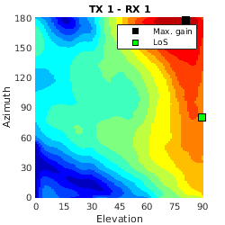
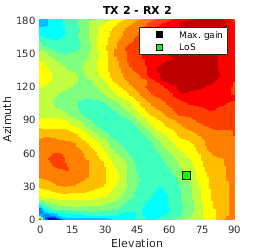
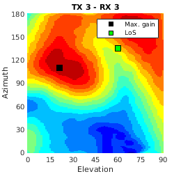

</p>

and outdoor deployment:

<p align="middle">

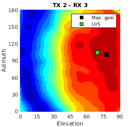
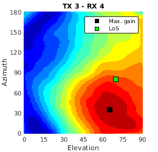
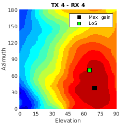
</p>

### Understanding our ML-based antenna steering

NetBeam advocates for a fast antennna steering using Machine Learning inference. In particular, it uses the Kriging method, which generates predictions of the channel gains at unvisited angular combinations taking the visited ones as inputs. The predictions are made using the prior knowledge on the angular/spatial correlation of the channel gains. In our proposal we assumed and further validated a Gaussian spatial correlation. One could validate the Gaussian prior (or Kernel) by running the following script:

```Matlab
test_prior('indoor')  % Computes the variogram on the indoor experimental data and fits a Gaussian Kernel
test_prior('outdoor')  % Computes the variogram on the outdoor experimental data and fits a Gaussian Kernel
```

This generates the following plots:

<p align="middle">
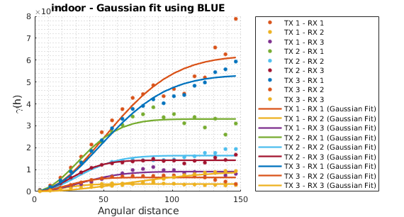
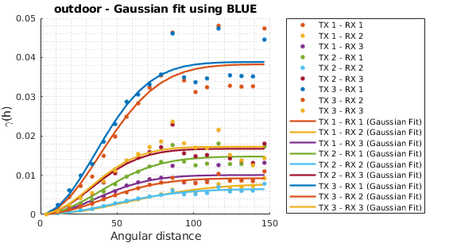
</p>

To understand the behavior of the Kriging method, this repository includes a simple test under *test_easykriging.m*, which loads the data from the experiments and assesses the gain prediction and its associated uncertainty given a set of known/visited angles. It takes one input (knownRatio), which is the ratio of unknown angles over the known.

The following command:
```Matlab
test_easykriging(10)  % Apply Kriging with ratio 10
test_easykriging(6)  % Apply Kriging with ratio 6
```
Generates the two figures shown below. As the ratio (K) increases, the uncertainty also increases as there's less visited angles (known).

<p align="middle">
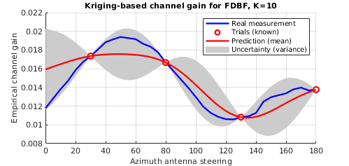
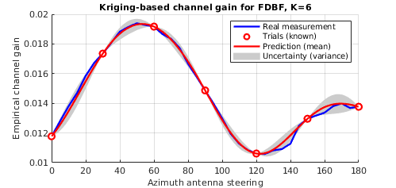
</p>

### Impact of our antenna steering method

The problem of finding the best antenna steering fits within the so-called Efficient Global Optimization (EGO) framework, which aims at finding the optimum of a function that is not known a priori. In our case, this function is the angular domain, as it is infeasible to explore (try) all the angular combinations to select the one that offers the maximum channel gain. 

NetBeam implements multiple angular acquisition policies that explore the angular map in a sequential fashion. That is, select one angular combination, re-compute the predicted angular map and select the best one to try after. Some acquisition functions are Random, Probability of Improvement (PI) and Uncertainty Minimization (UM). While PI is more exploitation-oriented, UM takes an exploratory approach by selecting those angles that have high uncertainty.

NetBeam also implements a novel acquisition function that we refer to as DIRECT-UM. While DIRECT (Divide In RECTangles) discretizes the map in a scattered and uniform manner, UM picks among those that perceive a higher uncertainty. Thus, providing a fair balance between exploration and exploitation.

The script to assess the performance is:
```Matlab
test_orientation('outdoor')  % accepts indoor and outdoor
```
The script generates the plots shown below, which assess the gap to optimality for any given policy and offline/online number of trials. 

<p align="middle">
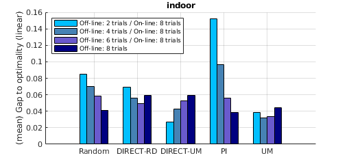
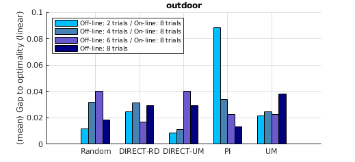
</p>

Here, offline refers to a pre-defined and scattered location in the map, while online refers to those selections that are based on the exploratory stage of the map at the moment. Also, gap to optimality is the difference between the maximum achievable gain (from exhaustive search) and the one offered by a particular policy.

As presented in [1], DIRECT-UM offers the minimum gap to optimality among any other combination and benefits greatly from the online stage.

### Impact of NetBeam

The ultimate goal of NetBeam is to minimize the overall transmit power while still meeting the individual SNR demands. To validate that, we use the collected set of channels from our experiments, which comprise a complete set of channels for any given angular combination, wide set of locations and environments (indoor and outdoor).

The *test_global* script helps assessing the overall performance of NetBeam. That is, including the three stages of antenna orientation, antenna selection and Beamforming. First, the script needs to characterize the resulting channels from the first stage. We can easily do that by running the scripts below:

```Matlab
CBG_parse_channels('indoor');  % for indoor data
CBG_parse_channels('outdoor');  % for outdoor data
```

This may take a while to execute so please be patient. Next, we can call the overall NetBeam code by running the script below. In this example, we use the data from the indoor experiments.

```Matlab
test_global('indoor')  % antenna orientation, antenna selection and SDP Beamforming
```

The output of the script above generates the Figures shown below. Note that the performance is subjected to the individual SNR requirements for any given user. This is a sample code that takes 3 users (RX) and 12 TX antennas, since it validates the experimental data.

<p align="middle">

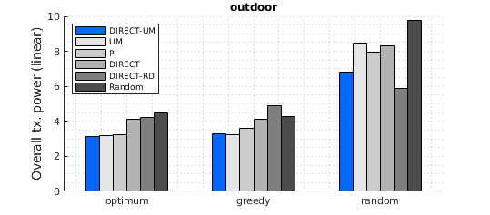
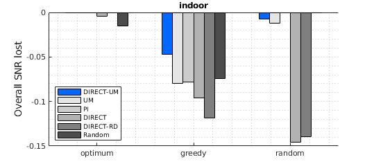
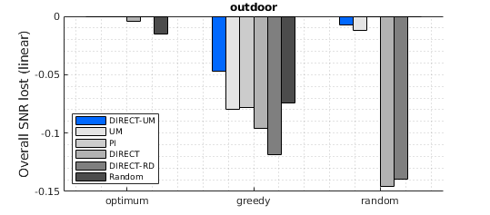
</p>

## Contact

For more information about the code, please don't hesitate to contact us by email. We'll be happy to assist you and answer any question you may have.

Carlos Bocanegra Guerra  
PhD Candidate  
Electrical and Computer Engineering (EECE)  
Northeastern University  
bocanegrac@coe.neu.edu

Kaushik R. Chowdhury  
Professor  
Electrical and Computer Engineering (EECE)  
Northeastern University  
krc@ece.neu.edu

## Acknowledgements

This work is supported by DARPA under the Young Faculty Award grant N66001-17-1-4042. We are grateful to Dr. Tom Rondeau, program manager at DARPA, for his insightful comments and suggestions that significantly improved the quality of the work.

## References

[1] C. Bocanegra, K. Alemdar, S. Garcia, C. Singhal and K. R. Chowdhury, “NetBeam: Network of Distributed Full-dimension Beamforming SDRs for Multi-user Heterogeneous Traffic,” IEEE Dynamic Spectrum (DySpan), Newark, NJ, 2019